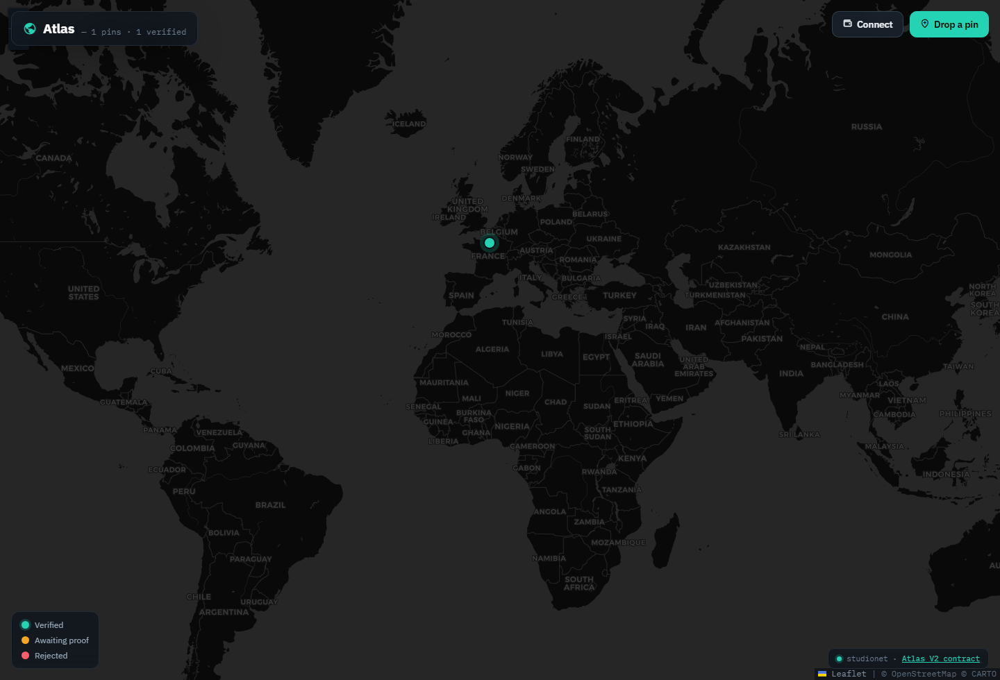
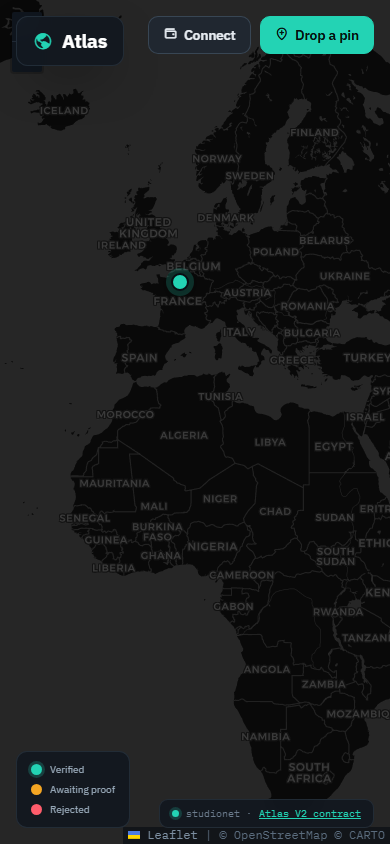

# Atlas

Atlas is a GenLayer place-verification map. It turns a simple pin into a public evidence record: coordinates, source URLs, observations, validator review, challenge windows, appeals, reputation, and audit logs.

The interface is intentionally map-first. A user drops a pin, attaches a public source, and asks GenLayer validators to decide whether the place is real and whether the coordinates match the evidence.



## Live Deployment

| Item | Value |
| --- | --- |
| Network | GenLayer Studionet |
| Chain ID | `61999` |
| Contract | `0x4F611050934677D94940c2998aF336EE9BEf9023` |
| Contract Explorer | https://explorer-studio.genlayer.com/address/0x4F611050934677D94940c2998aF336EE9BEf9023 |
| Deploy TX | `0x0cfdcda1779cace53323d26e69c7e80ae66ceede479d1447863f272544c39acd` |
| Deployed | `2026-06-23T16:31:49.455Z` |

## What It Does

Atlas is built around a narrow question: should this map pin be trusted?

The contract stores the claim and the evidence around a place, then uses GenLayer web + LLM consensus to check:

- whether the place exists as a real-world location
- whether the submitted name, description, and category match the source
- whether the coordinates are plausible for that source
- whether the evidence contains prompt-injection or low-credibility signals
- whether a challenge or appeal should change the current verdict

## Product Surface

- Full-screen dark cartographic interface using Leaflet and CARTO tiles.
- Click-to-drop pin flow with category, coordinates, description, and source URL.
- Live Studionet reads for current pin count and verified count.
- Wallet-triggered writes through an injected EVM wallet.
- Detail panel for place status, source link, submitter, and validator rationale.
- Public contract explorer link wired into the production footer.



## Contract Design

`contracts/atlas_v2.py` is the deployed GenLayer contract.

It is not a single add-and-read demo. Atlas V2 manages a complete place-verification protocol:

- `create_place` / `add_place` for sourced map pins.
- `add_source` for source expansion.
- `add_observation` for field notes or extra context.
- `open_review` and `review_place_with_genlayer` for AI-assisted place validation.
- `open_challenge_window` and `submit_challenge` for counter-claims.
- `resolve_challenge_with_genlayer` for challenge rulings.
- `submit_appeal` and `resolve_appeal_with_genlayer` for escalation.
- `finalize_place` and `archive_place` for lifecycle closure.
- `recalculate_reputation` for participant scoring.

The read surface exposes recent places, status/category/submitter indexes, sources, observations, reviews, challenges, appeals, audit logs, risk flags, public summaries, reputation, top contributors, frontend bootstrap data, contract stats, and a quality score.

## Verification Model

Atlas V2 stores each place as JSON and keeps secondary indexes in `TreeMap` structures. Reviews and dispute rulings call:

- `gl.nondet.web.render`
- `gl.nondet.exec_prompt`
- `gl.eq_principle.prompt_comparative`

Model output is normalized into strict JSON fields such as `verdict`, `confidenceBps`, `coordinateMatchBps`, `existenceBps`, `sourceScores`, `riskFlags`, and ruling deltas. Evidence pages are treated as untrusted data, and prompts explicitly instruct validators to ignore instructions embedded in the page content.

## Smoke Trail

The deployed Studionet smoke run finalized the full protocol path:

| Step | Transaction |
| --- | --- |
| `set_atlas_standard` | `0xe885c0b3a7f084ceda35bb7935339fd8bed61dec3eb4297fd625a9369c8e05a4` |
| `create_place` | `0x22b557eba74cfda4d3dd0a2fbae1de6465c46942aa650ddcd545e8237539186b` |
| `add_source` wiki | `0x09ed0658cbb3e8b4a1654755c87c99c10e6be3411d1cbc48c2c97a89d0f566ba` |
| `add_source` encyclopedia | `0xa552ba694901b12862fdeb279e4fd7f44d8b2238c7e0acb27fbb05f368bcada1` |
| `add_observation` | `0x2fa41f61936722ba4e5619240cf1a8a27ad5b9e4665a5bd4bbf8d20d03ef9ad7` |
| `open_review` | `0xea04568c6894737ef1ec31c1cd2200a344f415e89a50df68bde874684d688550` |
| `review_place_with_genlayer` | `0xe3074011057b9fceadeaecabf456181c36fbf5de325981d7718dbee16bb55e63` |
| `submit_challenge` | `0xe595d69949398e0a3f09e002c8c4c3746e40384e49258cbf3919869744a7f337` |
| `resolve_challenge_with_genlayer` | `0xabf243e7545749ad144103d615e4fc8d26deb981cf7bbbcb79a91779fff689c6` |
| `submit_appeal` | `0x0c8f6c578cec9eea42b90da26a831f92f9e60533b6f96a7b3f327b4f3076bce1` |
| `resolve_appeal_with_genlayer` | `0xd99882295e4b0b4ffebf4a3f01ef52f3ae5ec5fe3745ce6ee7388259a95f9b54` |
| `finalize_place` | `0xb8038c155ec16379a9310dedf7ba72b043b2beb91682266b5b8cd0c4acf03c0d` |
| `archive_place` | `0x4628a62b3ffefe7a6e3fefc09bf3e55a937537d875c6e49d7ba885be8c164119` |
| `recalculate_reputation` | `0x0c058071de5902fa51475be65e77994b9b6334319e98b4129644d781acfa4207` |

## Project Structure

```text
index.html              Static map shell
styles.css              Cartographic UI and responsive panel styling
app.js                  Studionet reads/writes and Leaflet interaction
shared/genlayer-lite.js Browser-only GenLayer helper
contracts/atlas_v2.py   Deployed GenLayer contract source
deployment.json         Public deployment and smoke metadata
vercel.json             Production security headers
```

## Local Development

```powershell
npm install
npm run dev
```

Open:

```text
http://localhost:4801
```

Because the app uses browser ES modules and CDN imports, serve it over localhost instead of opening `index.html` directly.

## Production Deploy

This repository is a static Vercel deployment. No build step and no private environment variables are required.

Recommended Vercel settings:

| Setting | Value |
| --- | --- |
| Framework Preset | Other |
| Build Command | None |
| Output Directory | `.` |
| Environment Variables | None required |

## Security

- No private keys, seed phrases, vault files, or wallet exports belong in this repo.
- The included address and transaction hashes are public Studionet metadata.
- User writes require a connected injected wallet and explicit confirmation.
- Production headers are defined in `vercel.json`.
- Public evidence URLs are opened externally with `rel="noopener"`.

Run the repository safety check before pushing:

```powershell
npm run security:scan
```
